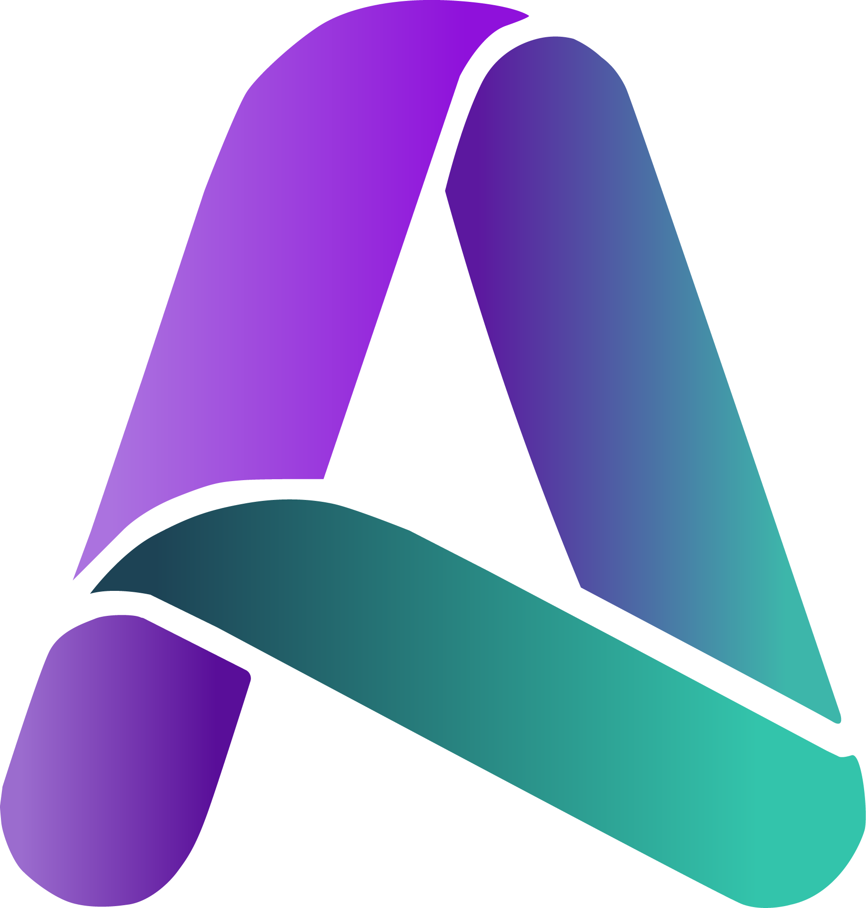

<!--

 
  

-->
<h3 align="center">Ladies and Gentlemen, I'm Aya Nabil</h3>
<h4 align="center">Full-Stack AI Engineer | Applied Data Scientist | Future AI Researcher isa </h4>
<samp align="center">

  Implementing: <a href="https://attention-is-all-you-need.onrender.com/"> Attention is all you need </a>
   
  Built:
  <a href="https://ayanexus.dev/">portfolio</a> |
  <a href="https://vloomeo.ashraf.zone/">vloomeo</a> |
  <a href="https://www.swanexus.dev/">swan</a>
   
  Developing:
  <a href="https://api.whatsapp.com/send/?phone=971586633824&text&type=phone_number&app_absent=0"> maya</a>
   

</samp>
 
<!-- 
  
 -->
<!--
<h3 align="left">Connect with me:</h3>

  
  
  

-->
<!--
<h3 align="left">Languages and Tools:</h3>

  
  
  
  
  
  
  
  
  
  
  
  
  
  

-->
<table align="center">
  <tr>
    <td></td>
    <td></td>
  </tr>
</table>

[//]: # (

 )

[//]: # (  )

[//]: # (

)

 
